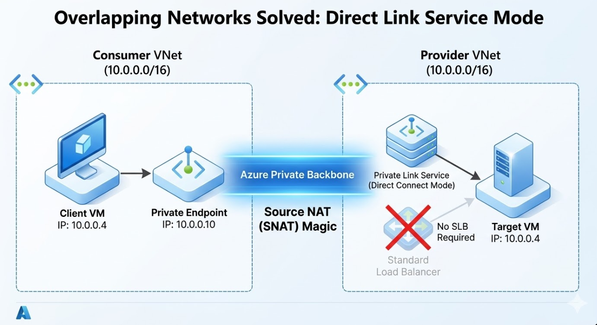
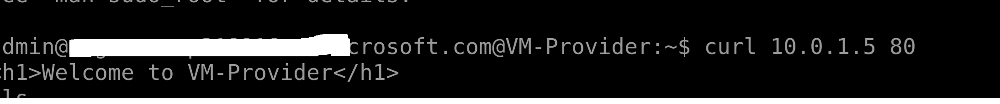
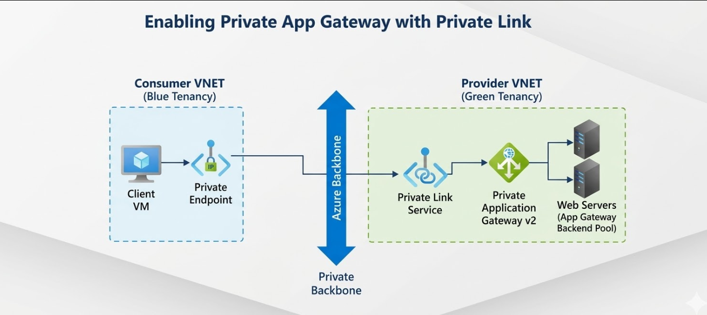
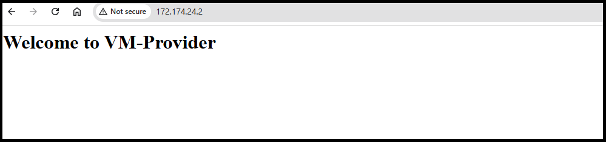
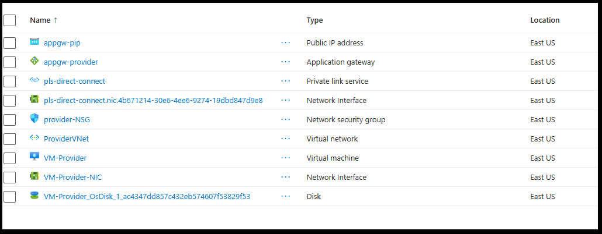

# Azure Private Link Service Direct Connect Lab

## What is Private Link Direct Connect?

**Private Link Direct Connect** is an Azure networking feature in *preview* that revolutionizes how service providers expose resources to consumers securely and privately. It removes the need for intermediate infrastructure (load balancers) by creating a **direct connection from consumer endpoints to provider network interfaces**.

**Official Documentation:**
https://learn.microsoft.com/en-us/azure/private-link/configure-private-link-service-direct-connect?tabs=powershell%2Cpowershell-pe%2Cverify-powershell%2Ccleanup-powershell#create-a-private-endpoint-to-test-connectivity


### The Problem It Solves

Traditional Azure networking often requires:
- **Public IPs**: Exposing your services to the internet
- **Load Balancers**: Managing traffic between consumers and services
- **Complex routing**: Multiple layers of indirection increasing latency
- **Management overhead**: More infrastructure to maintain and secure

### Direct Connect - The Solution

Instead of:
```
Consumer → Private Endpoint → Load Balancer → Network Interface → Service
```

With Direct Connect, you get:
```
Consumer → Private Endpoint → Network Interface (Direct!)
```

### Key Benefits

| Aspect | Traditional PLS | Direct Connect PLS |
|--------|-----------------|-------------------|
| **Architecture** | Requires Standard Load Balancer | No load balancer needed |
| **Connection Path** | Consumer → LB → NIC | Consumer → NIC (Direct!) |
| **Latency** | Higher (multi-hop) | Lower (direct path) |
| **Complexity** | Complex routing rules | Simplified setup |
| **Cost** | LB costs included | Reduced infrastructure costs |
| **Scalability** | Limited by LB capacity | Better for direct connections |
| **Status** | General Availability | Preview ⭐ |

## What This Lab Demonstrates

This comprehensive solution includes **TWO deployment scenarios** showcasing different applications of Azure Private Link Direct Connect:

### Scenario 1: Overlapping IP Addresses with Nginx VM
Deploy overlapping VNets (both 10.0.0.0/16) that would normally be impossible to connect. Use Direct Connect to establish connectivity without peering.

**Script**: `overlapp-direct-connect-solution.ps1`

1. **Provider infrastructure**: VNet with Nginx VM
2. **Consumer infrastructure**: Overlapping VNet with Private Endpoint
3. **Direct Connect mode**: Bypasses load balancers, enables NIC-to-NIC connectivity
4. **Verification**: Test via curl/HTTP across private networks

### Scenario 2: Application Gateway with Direct Connect (No Load Balancer Required)
Deploy an Application Gateway with private frontend IP exposed via Direct Connect. Demonstrates how App Gateway doesn't need a Standard Load Balancer when using Direct Connect.

**Script**: `AppGw-to-DirectConnect.ps1`

1. **Provider infrastructure**: VNet with Nginx VM backend + Application Gateway v2 (private)
2. **App Gateway with Direct Connect**: Private frontend IP exposed via PLS Direct Connect
3. **Consumer infrastructure**: Overlapping VNet with Private Endpoint to App Gateway
4. **No Load Balancer**: Direct Connect eliminates the need for Standard Load Balancer

### Real-World Use Cases

✅ **SaaS Providers**: Expose services without public endpoints
✅ **Enterprise Integrations**: Connect internal systems securely
✅ **Data Sharing**: Private access to databases and APIs
✅ **Hybrid Cloud**: Connect on-premises to Azure privately
✅ **Multi-tenant Scenarios**: Multiple customers, zero internet exposure
✅ **Private Application Gateway**: Expose a private App Gateway to clients with overlapping address spaces ⬇️

---

## Deployment Scenarios

### Scenario 1: Overlapping IP Addresses with Nginx VM

**Use Case**: Organizations with overlapping address spaces need to connect to services securely without reconfiguring their networks.

**Problem Solved**:
- ❌ VNet Peering — blocked by overlapping IP ranges
- ❌ Public endpoints — expose internal resources
- ✅ **Direct Connect** — enables secure, private connectivity across overlapping networks

**Deployment**: Fully automated, no parameters needed
- Run: `.\overlapp-direct-connect-solution.ps1`
- Duration: 15-20 minutes
- Creates: Provider RG + Consumer RG with overlapping VNets



**Architecture**:
```
Provider VNet (10.0.0.0/16)          Consumer VNet (10.0.0.0/16)
├─ Nginx VM (10.0.1.x)               ├─ Test VM (10.0.1.x)
├─ PLS Direct Connect                └─ Private Endpoint
└─ No Load Balancer needed
```

**Testing Flow**:
1. Consumer VM sends request to Private Endpoint
2. Direct Connect routes to Provider VM's NIC
3. Nginx responds with web content
4. Overlapping IPs (10.0.1.x in both VNets) cause no conflicts


---

### Scenario 2: Application Gateway with Direct Connect (No Load Balancer Required)

**Use Case**: Expose a private Application Gateway to clients with optional overlapping address spaces.

**When to Use Scenario 2**:
- You want App Gateway features (routing rules, WAF, SSL termination)
- You want to test Direct Connect with a realistic component
- You want flexible backend selection
- **Important**: Run Scenario 1 first to create the base Provider infrastructure

**Deployment**: Manual, requires parameters
- Prerequisites: Scenario 1 infrastructure must exist
- Run: `.\AppGw-to-DirectConnect.ps1 -ProviderRG "your-rg" -BackendVMName "your-vm"`
- Duration: 15-20 minutes
- Creates: App Gateway only (reuses existing Provider VNet from Scenario 1)

### The Problem

Azure Application Gateway commonly uses a **private frontend IP only** (no public IP) for internal workloads. This creates a challenge:

> **How do clients in a different VNet -  especially with overlapping IP ranges securely reach a private Application Gateway?**

Standard solutions fail here:
- ❌ **VNet Peering** — blocked when address spaces overlap
- ❌ **Public IP on App Gateway** — defeats the purpose of private networking
- ❌ **Standard Load Balancer** — adds complexity and cost

### The Solution: PLS Direct Connect

By placing a **Private Link Service with Direct Connect** in front of the App Gateway's NIC, clients consume it through a Private Endpoint — regardless of overlapping IPs.

```
┌─────────────────────────────────────────┐
│              CLIENT VNET                │
│           (any address space)           │
│                                         │
│   ┌──────────┐    ┌───────────────────┐ │
│   │ Client   │───▶│ Private Endpoint  │ │
│   │   VM     │    └────────┬──────────┘ │
│   └──────────┘             │            │
└───────────────────────────-┼────────────┘
                             │ Private Link
                             │ (Direct Connect)
┌────────────────────────────┼────────────┐
│           PROVIDER VNET    │            │
│                            ▼            │
│   ┌──────────────────────────────────┐  │
│   │   Private Link Service           │  │
│   │   (Direct Connect → App GW NIC)  │  │
│   └────────────────┬─────────────────┘  │
│                    ▼                    │
│   ┌──────────────────────────────────┐  │
│   │   Application Gateway (Private)  │  │
│   │   Frontend IP: 10.x.x.x          │  │
│   └────────────────┬─────────────────┘  │
│                    ▼                    │
│   ┌──────────────────────────────────┐  │
│   │   Backend Pool (Web Servers)     │  │
│   │   VM1 / VM2 / App Service        │  │
│   └──────────────────────────────────┘  │
└─────────────────────────────────────────┘
```


### Why This Works

| Challenge | How Direct Connect Solves It |
|-----------|------------------------------|
| Overlapping Client IPs | Private Link isolates traffic — no peering needed |
| App GW has no public IP | PLS exposes the private NIC directly to consumers |
| No Load Balancer wanted | Direct Connect bypasses LB requirement |
| Multiple tenants/clients | Each client gets their own Private Endpoint |
| Secure by default | Traffic never leaves the Microsoft backbone |

### Traffic Flow

```
1. Client VM sends request to Private Endpoint IP
          ↓
2. Azure routes through Private Link Service
          ↓
3. Direct Connect delivers directly to App Gateway NIC
          ↓
4. App Gateway applies routing rules, WAF, SSL termination
          ↓
5. Request forwarded to backend web server
          ↓
6. Response returned via same private path
```

## Real-World Use Cases

✅ **Overlapping Address Spaces** — Connect VNets that can't be peered
✅ **Private Application Gateway** — Expose App Gateway without public IP
✅ **SaaS Providers** — Expose services without public endpoints
✅ **Enterprise Integrations** — Connect internal systems securely
✅ **Data Sharing** — Private access to databases and APIs
✅ **Hybrid Cloud** — Connect on-premises to Azure privately
✅ **Multi-tenant Scenarios** — Multiple customers, zero internet exposure

---

## Architecture Comparison

### Scenario 1: Nginx VM with Direct Connect
```
Consumer VNet          Provider VNet
┌─────────────────┐   ┌──────────────────┐
│ Consumer VM     │   │ Nginx VM         │
│   10.0.1.100    │──→│  10.0.1.x        │
│ Private Endpoint│ ↓ │ PLS Direct       │
└─────────────────┘   └──────────────────┘
```

### Scenario 2: Application Gateway with Direct Connect
```
Consumer VNet               Provider VNet
┌──────────────────┐       ┌─────────────────────────────┐
│ Consumer VM      │       │ Application Gateway (Private)│
│  10.0.1.100      │       │    Frontend: 10.0.2.10      │
│ Private Endpoint │───→   │ ↓ PLS Direct Connect        │
└──────────────────┘       │ ├─ Routing Rules            │
                           │ ├─ WAF Protection           │
                           │ └─ Backend: Nginx VM        │
                           └─────────────────────────────┘
```

#### AppGw Test Result


#### No Load balancer 


---

### This Lab vs. App Gateway Use Case

This lab's Scenario 1 uses an **Nginx VM** to simulate the same connectivity pattern as App Gateway. The core infrastructure (PLS + Direct Connect + Private Endpoint) is identical—Scenario 2 shows the real-world App Gateway deployment.

---

## Overview

This solution uses **Bicep Infrastructure-as-Code** to deploy a complete Azure Private Link Service (PLS) infrastructure with **Direct Connect mode enabled** in the East US region. It creates a provider-consumer architecture demonstrating private connectivity without exposing resources to the public internet.

### Available Deployment Scripts

| Scenario | Script | Use Case | Duration | Parameters Required |
|----------|--------|----------|----------|---------------------|
| **Overlapping IPs** ⭐ | `overlapp-direct-connect-solution.ps1` | VNet with Nginx VM + Overlapping Consumer VNet | 15-20 min | ❌ No (fully automated) |
| **App Gateway + Direct Connect** | `AppGw-to-DirectConnect.ps1` | Application Gateway exposed via Direct Connect (no LB) | 15-20 min | ✅ Yes (manual, optional) |
| **Utility Scripts** | `privatelinkdirectconnect.ps1` | Standalone PLS creation | Minimal | ✅ Yes |
| | `create-private-endpoint.ps1` | Private Endpoint creation | Minimal | ✅ Yes |
| | `enable-direct-connect.ps1` | Direct Connect feature activation | Minimal | ✅ Yes |

## Architecture

```
┌─────────────────────────────────────────────────────────────────┐
│                        PROVIDER VNET                             │
│                      (10.0.0.0/16)                               │
├─────────────────────────────────────────────────────────────────┤
│                                                                   │
│  ┌──────────────────────┐        ┌──────────────────────────┐   │
│  │  Backend Subnet      │        │    NAT Subnet            │   │
│  │  (10.0.1.0/24)       │        │    (10.0.2.0/24)         │   │
│  │                      │        │                          │   │
│  │  ┌───────────────┐   │        │  ┌──────────────────┐    │   │
│  │  │  Linux VM     │   │        │  │      PLS         │    │   │
│  │  │  (Target)     │   │        │  │ (Direct Connect) │    │   │
│  │  │ NIC IP: 10... │   │        │  │   Enabled: true  │    │   │
│  │  └───────────────┘   │        │  └──────────────────┘    │   │
│  │                      │        │         │                │   │
│  └──────────────────────┘        └─────────┼────────────────┘   │
│                                            │                     │
└────────────────────────────────────────────┼─────────────────────┘
                                             │
                        Direct Connect Mode  │
                        (No LB required)     │
                                             │
┌────────────────────────────────────────────┼─────────────────────┐
│                      CONSUMER VNET         │                     │
│                    (10.0.0.0/16)           │                     │
├────────────────────────────────────────────┼─────────────────────┤
│                                            │                     │
│                               ┌────────────▼────────────┐        │
│                               │  Consumer Subnet        │        │
│                               │  (10.0.1.0/24)          │        │
│                               │                         │        │
│                               │  ┌────────────────────┐ │        │
│                               │  │ Private Endpoint   │ │        │
│                               │  │ (ConsumerEndpoint) │ │        │
│                               │  └────────────────────┘ │        │
│                               │                         │        │
│                               └─────────────────────────┘        │
│                                                                   │
└───────────────────────────────────────────────────────────────────┘
```

## Direct Connect Technical Deep-Dive

### How It Works

1. **Provider Setup**: Provider creates a Private Link Service with Direct Connect enabled and multiple IP configurations
2. **Consumer Discovery**: Consumer creates a Private Endpoint pointing to the PLS
3. **Direct Connection**: Azure establishes a direct connection from PE → PLS NIC (bypassing load balancers)
4. **Traffic Flow**: All traffic from consumer applications goes directly to provider NIC

### Requirements for Direct Connect

- ⭐ **Preview Feature Registration**: Feature must be enabled in your subscription
- **Minimum 2 IP Configurations**: PLS requires at least 2 IP configs for Direct Connect mode
- **Network Policies**: Must disable Private Link Service network policies on the subnet
- **Subnet Configuration**: Proper subnet setup with correct address spaces

### Key Differences from Standard PLS
| Factor | Standard PLS | Direct Connect PLS |
|--------|-------------|-------------------|
| LB Required | Yes (Standard) | No |
| Target | Load Balancer | NIC directly |
| Latency | Standard | Lower |
| Complexity | Higher | Lower |
| Preview Status | GA | Preview |
| IP Configs | 1 required | 2+ required |

## Resources Deployed

### Core Files Included

| File | Purpose | Type | Scenario | Parameters |
|------|---------|------|----------|------------|
| **overlapp-direct-connect-solution.ps1** | ⭐ **Scenario 1** - Nginx VM with overlapping VNets | PowerShell | Overlapping IPs | ❌ None (fully automated) |
| **AppGw-to-DirectConnect.ps1** | ⭐ **Scenario 2** - Application Gateway with Private Link | PowerShell | App Gateway | ✅ RG, VM name, port (required) |
| `overlap-test.bicep` | Infrastructure template (VNet, VM, Nginx) | Bicep | Scenario 1 |  |
| `overlap-provider.bicepparam` | Provider-side configuration | Parameter | Scenario 1 |  |
| `overlap-consumer.bicepparam` | Consumer-side configuration | Parameter | Scenario 1 |  |
| `privatelinkdirectconnect.ps1` | Standalone PLS creation utility | PowerShell | Utility | ✅ Yes |
| `create-private-endpoint.ps1` | Private Endpoint creation utility | PowerShell | Utility | ✅ Yes |
| `enable-direct-connect.ps1` | Direct Connect enablement utility | PowerShell | Utility | ✅ Yes |
| `private-endpoint.json` | Private Endpoint ARM template | ARM/JSON | Utility | ✅ Yes |
| `README.md` | This comprehensive guide | Documentation | Both |  |
| `QUICK_REFERENCE.md` | CLI commands reference | Documentation | Both |  |

### Provider Infrastructure
1. **ProviderVNet** (10.0.0.0/16)
   - BackendSubnet (10.0.1.0/24) - Houses the Linux VM and target NIC
   - NatSubnet (10.0.2.0/24) - Houses the PLS frontend

2. **Linux Virtual Machine** (Ubuntu 20.04)
   - Size: Standard_B2s (configurable)
   - SSH access via public IP
   - OS disk: Premium managed disk

3. **Network Interfaces**
   - `TargetServer-NIC`: Connected to DirectConnect and the PLS
   - `TargetServer-NIC` (VM): For SSH management access

4. **Private Link Service**
   - Name: pls-direct-connect
   - Direct Connect: **Enabled**
   - Visibility: All subscriptions (*)
   - Auto-approval: All subscriptions (*)

5. **Network Security Groups**
   - Provider NSG: Allows SSH + internal 10.0.0.0/8 traffic
   - Consumer NSG: Allows internal 10.0.0.0/8 traffic

### Consumer Infrastructure
1. **ConsumerVNet** (10.0.0.0/16) - Same address space as Provider
   - ConsumerSubnet (10.0.1.0/24)

2. **Private Endpoint**
   - Name: ConsumerEndpoint
   - Connection Name: DirectConnectConn
   - Links to the Private Link Service

3. **Network Security Groups**
   - Consumer NSG: Allows internal traffic

## Prerequisites

### For Deployment
1. **Azure CLI** (v2.40.0+): [Install Azure CLI](https://docs.microsoft.com/cli/azure/install-azure-cli)
2. **Azure Bicep CLI**: Included with Azure CLI
3. **Azure Subscription** with sufficient permissions
4. **SSH Key Pair**: Generate with `ssh-keygen -t rsa -b 4096 -f ~/.ssh/id_rsa`


## Quick Start (3 Steps)

### Choose Your Scenario

**Scenario 1 - Overlapping IP Addresses with Nginx VM** ⭐ (Recommended - Fully Automated)
```powershell
#1. Clone git repo
  git clone https://github.com/Iditbnaya/PrivateLink--DirectConnect-Lab.git

  # Navigate to the project folder
  cd PrivateLink--DirectConnect-Lab

# 2. Generate SSH key (if you don't have one)
ssh-keygen -t rsa -b 4096 -f ~/.ssh/id_rsa

# 3. Run the Nginx deployment (fully automated - no parameters needed)
.\overlapp-direct-connect-solution.ps1
```

✅ **That's it!** Everything deploys automatically in ~15-20 minutes with **zero manual configuration required**.

---

**Scenario 2 - Application Gateway with Direct Connect** (Optional - Requires Manual Parameters)

⚠️ **IMPORTANT**: Run **Scenario 1 first** to create the base infrastructure, then optionally run Scenario 2.

```powershell
# After Scenario 1 is complete, you can optionally deploy App Gateway with Direct Connect
# First, find your deployed Resource Group and VM name:
$rg = az group list --query "[?contains(name, 'DirectConnect-Provider-RG')].name" -o tsv | Select-Object -First 1
az vm list -g $rg --query "[].name" -o tsv

# Then run the App Gateway script with explicit parameters:
.\AppGw-to-DirectConnect.ps1 -ProviderRG "DirectConnect-Provider-RG-6cd49640" -BackendVMName "VM-Provider"
```

**Available Parameters**:
- `-ProviderRG`: Resource group containing existing Provider infrastructure *(required)*
- `-BackendVMName`: Name of the VM to expose as backend *(required - must exist in RG)*
- `-ProviderVNetName`: VNet name (default: "ProviderVNet")
- `-BackendPort`: Backend service port (default: 80)
- `-Location`: Azure region (default: "eastus")

## Key Features

### Scenario 1 (Overlapping IPs with Nginx VM) ⭐ **PRIMARY**
✅ **Single Command Deployment** - `.\overlapp-direct-connect-solution.ps1` (zero parameters)
✅ **Fully Automated** - No manual steps required
✅ **Overlapping Address Spaces** - Demonstrates key Direct Connect feature
✅ **Quick Deployment** - 15-20 minutes total
✅ **Error Handling** - Graceful failures with guidance
✅ **Colored Output** - Easy progress tracking with detailed logging
✅ **Comprehensive Logging** - Full debug information included
✅ **Production Ready** - Follows Azure best practices

### Scenario 2 (Application Gateway) ⚠️ **OPTIONAL**
✅ **Flexible Backend Selection** - Specify which VM to expose via `-BackendVMName`
✅ **Flexible Port Configuration** - Change backend port via `-BackendPort`
✅ **Reusable** - Can run multiple times on same infrastructure
✅ **Real-World Use Case** - Production-identical App Gateway architecture
✅ **App Gateway Features** - Routing rules, WAF, SSL termination ready
✅ **No Load Balancer** - Demonstrates Direct Connect advantage
✅ **Parameter-driven** - Full control over deployment targets
✅ **Fully Automated** - Handles NSP automatically, no manual steps


## Technical Note - Network Isolation (NSP)

**Background:**
Application Gateway Standard_v2 SKU can enable Network Security Perimeter (NSP), which prevents Private Link Service configuration. However, in practice, NSP is typically already disabled or doesn't block the Private Link configuration.

**How the Script Handles It:**
The `AppGw-to-DirectConnect.ps1` script automatically proceeds with Private Link configuration. If NSP prevents the operation, it will fail at that step with a clear error message, allowing you to troubleshoot.

**If You Encounter NSP Error:**
```
ERROR: Application Gateway ... with NetworkIsolation is not supported with
feature Private Link Configuration
```

Solution:
1. Go to Azure Portal → Your App Gateway → Settings → Configuration
2. Look for "Network Isolation" or "Network Security Perimeter"
3. If found, toggle it to OFF/DISABLED
4. Click SAVE and wait 1-2 minutes
5. Re-run the script

## Deployment

### Option 1: Deploy Scenario 1 (Overlapping IPs with Nginx VM) ⭐ PRIMARY DEPLOYMENT

**Run PowerShell as Administrator:**

```powershell
cd "C:\temp\Linkedin\Private Link service Direct Connect"

# Run the Nginx VM deployment script (fully automated)
.\overlapp-direct-connect-solution.ps1
```

**Features:**
- ✅ Creates Provider RG with unique GUID suffix (e.g., DirectConnect-Provider-RG-6cd49640)
- ✅ Creates VNet (10.0.0.0/16) + Ubuntu VM with Nginx
- ✅ Creates Consumer RG with overlapping VNet (10.0.0.0/16)
- ✅ Sets up Private Link Service with Direct Connect enabled
- ✅ Creates Private Endpoint for connectivity
- ✅ Auto-enables Direct Connect mode via Azure CLI
- ✅ Includes error handling and colored progress output
- ✅ **~15-20 minutes total**
- ✅ **ZERO manual parameters required** - fully automated

**With Custom Parameters** (optional):
```powershell
.\overlapp-direct-connect-solution.ps1 `
    -Location "westus2"
```

---

### Option 2: Deploy Scenario 2 (Application Gateway with Direct Connect) ⚠️ OPTIONAL

**Prerequisites**: Scenario 1 must be deployed first (creates the Provider infrastructure)

**Find your deployed resources:**
```powershell
# Find the Resource Group created by Scenario 1
$rg = az group list --query "[?contains(name, 'DirectConnect-Provider-RG')].name" -o tsv | Select-Object -First 1
Write-Host "Provider RG: $rg"

# List all VMs in that RG
az vm list -g $rg --query "[].name" -o tsv
```

**Run PowerShell as Administrator:**

```powershell
cd "C:\temp\Linkedin\Private Link service Direct Connect"

# Run the Application Gateway deployment script
# IMPORTANT: Provide the actual RG and VM names from Scenario 1
.\AppGw-to-DirectConnect.ps1 `
    -ProviderRG "DirectConnect-Provider-RG-6cd49640" `
    -BackendVMName "VM-Provider"
```

**Parameters Explained:**

| Parameter | Required | Default | Description |
|-----------|----------|---------|-------------|
| `-ProviderRG` | ✅ Yes | `DirectConnect-Provider-RG` | Resource group containing existing Provider infrastructure |
| `-BackendVMName` | ✅ Yes | (auto-detect) | Name of the backend VM (must exist in ProviderRG) |
| `-ProviderVNetName` | ❌ No | `ProviderVNet` | Virtual Network name |
| `-BackendPort` | ❌ No | `80` | Backend service port (change for non-HTTP services) |
| `-Location` | ❌ No | `eastus` | Azure region |

**Features:**
- ✅ Finds existing Provider infrastructure from Scenario 1
- ✅ Creates App Gateway subnets (10.0.2.0/24 and 10.0.3.0/24)
- ✅ Deploys Application Gateway v2 (Standard_v2)
- ✅ Configures private frontend IP (10.0.2.10)
- ✅ Enables Private Link configuration on App Gateway
- ✅ Creates HTTP listener and routing rules
- ✅ **~15-20 minutes total** (fully automated, no manual intervention needed)
- ✅ **Requires parameters** - you control which VM to expose

**Common Usage Examples:**

```powershell
# Example 1: Basic deployment
.\AppGw-to-DirectConnect.ps1 -ProviderRG "DirectConnect-Provider-RG-6cd49640" -BackendVMName "VM-Provider"

# Example 2: With custom backend port
.\AppGw-to-DirectConnect.ps1 `
    -ProviderRG "DirectConnect-Provider-RG-6cd49640" `
    -BackendVMName "VM-Provider" `
    -BackendPort 8080

# Example 3: Different location
.\AppGw-to-DirectConnect.ps1 `
    -ProviderRG "DirectConnect-Provider-RG-6cd49640" `
    -BackendVMName "VM-Provider" `
    -Location "westus2"
```

### Manual Deployment - Azure CLI

```bash
# 1. Define variables
RG="DirectConnect-Lab-RG-1"
LOCATION="eastus"
RESOURCE_PREFIX="dc"

# 2. Create resource group
az group create --name $RG --location $LOCATION

# 3. Get SSH public key
SSH_KEY=$(cat ~/.ssh/id_rsa.pub)

# 4. Deploy the template
az deployment group create \
  --name pls-direct-connect \
  --resource-group $RG \
  --template-file overlap-test.bicep \
  --parameters overlap-provider.bicepparam \
  --parameters sshPublicKey="$SSH_KEY"

# 5. View outputs
az deployment group show \
  --name pls-direct-connect \
  --resource-group $RG \
  --query properties.outputs -o table
```

### Using Azure Portal

1. Go to [Azure Portal](https://portal.azure.com)
2. Click **+ Create a resource** → Search "Bicep deployment"
3. Click **Create**
4. Paste the `overlap-test.bicep` content in the editor
5. Provide parameters using `overlap-provider.bicepparam`:
   - `location`: "eastus"
   - `vmSize`: "Standard_B2s"
   - `adminUsername`: "azureuser"
   - `sshPublicKey`: Paste your SSH public key (from `cat ~/.ssh/id_rsa.pub`)
6. Review + Create

## Validation & Verification

### Post-Deployment Verification

The `complete-direct-connect-solution.ps1` script includes automatic validation. For manual verification after deployment, use these commands:

**PowerShell:**
```powershell
$RG = "DirectConnect-Lab-RG-1"
az network private-link-service show `
  -g $RG `
  -n MyDirectLinkService `
  --query directConnectEnabled
```

**Bash:**
```bash
az network private-link-service show \
  -g DirectConnect-Lab-RG-1 \
  -n MyDirectLinkService \
  --query directConnectEnabled
```
Expected output: `true`

### 2. Check Private Endpoint Status

**PowerShell:**
```powershell
$RG = "DirectConnect-Lab-RG-1"
az network private-endpoint show `
  -g $RG `
  -n ConsumerEndpoint `
  --query "properties.privateLinkServiceConnections[0].properties.provisioningState"
```

**Bash:**
```bash
az network private-endpoint show \
  -g DirectConnect-Lab-RG-1 \
  -n ConsumerEndpoint \
  --query properties.privateLinkServiceConnections[0].properties.provisioningState
```
Expected output: `Succeeded`

### 3. Verify Connection State

**PowerShell:**
```powershell
$RG = "DirectConnect-Lab-RG-1"
az network private-endpoint show `
  -g $RG `
  -n ConsumerEndpoint `
  --query "properties.privateLinkServiceConnections[0].properties.connectionState.status"
```

**Bash:**
```bash
az network private-endpoint show \
  -g DirectConnect-Lab-RG-1 \
  -n ConsumerEndpoint \
  --query properties.privateLinkServiceConnections[0].properties.connectionState
```
Expected output: `Approved` or `Auto-Approved`

### 4. SSH to the Linux VM

**PowerShell:**
```powershell
$VM_IP = az vm show -d `
  -g DirectConnect-Provider-RG `
  -n TargetServer `
  --query publicIps -o tsv

Write-Host "Connecting to VM at: $VM_IP"
ssh azureuser@$VM_IP
```

**Bash:**
```bash
# Get the public IP
VM_IP=$(az vm show -d \
  -g DirectConnect-Provider-RG \
  -n TargetServer \
  --query publicIps -o tsv)

# Connect via SSH
ssh azureuser@$VM_IP
```

### 5. Test Nginx from Provider VM

```bash
# From within the Provider VM, verify Nginx is running
curl http://localhost

# From Consumer VM, test connectivity through Private Endpoint to Provider Nginx
curl http://10.0.1.4
```

Expected response: `<h1>Welcome to TargetServer</h1>`

## Network Configuration Details

### Provider VNet (10.0.0.0/16)
```
BackendSubnet (10.0.1.0/24)
├── TargetServer-NIC: 10.0.1.x (Dynamic)
├── TargetServer-NIC (VM): 10.0.1.x (Dynamic)
└── Public IP: Management access

NatSubnet (10.0.2.0/24)
└── PLS Frontend IP: 10.0.2.x (Dynamic)
```

### Consumer VNet (10.0.0.0/16)
```
ConsumerSubnet (10.0.1.0/24)
├── Private Endpoint: 10.0.1.x (Dynamic)
└── Private Endpoint NIC: 10.0.1.x (Dynamic)
```

## Direct Connect Connection Flow

```
1. Consumer VM in ConsumerVNet
   ↓
2. Creates connection to Private Endpoint
   ↓
3. Private Endpoint forwards to Private Link Service (Direct Connect)
   ↓
4. PLS Direct Connect bypasses LB, connects directly to Target NIC
   ↓
5. Traffic reaches TargetServer-NIC on ProviderVNet
   ↓
6. VM processes the request
```

## Security Considerations

### Network Security Groups
- **Provider NSG**: Restricts SSH to specific IPs (currently open - configure as needed)
- **Consumer NSG**: Allows only internal 10.0.0.0/8 traffic
- **Recommendations**:
  - Restrict SSH source IP: `--source-address-prefix <YOUR_IP>/32`
  - Use Azure Bastion for VM access instead of public IP

### Access Control
- PLS visibility set to all subscriptions (*)
- Auto-approval enabled for all subscriptions (*)
- **Recommendation**: Change to specific subscriptions in production

### Modification Example
```bicep
visibility: {
  subscriptions: [
    subscription().subscriptionId
  ]
}

autoApproval: {
  subscriptions: [
    subscription().subscriptionId
  ]
}
```

## Troubleshooting

### Issue: Private Endpoint shows "Pending" Connection
**Solution**: Check auto-approval settings on PLS
```bash
az network private-link-service show \
  -g DirectConnect-Lab-RG-1 \
  -n MyDirectLinkService \
  --query autoApproval
```

### Issue: Cannot SSH to VM
**Solution**: Check NSG rules and public IP
```bash
# Verify public IP
az vm list-ip-addresses \
  -g DirectConnect-Lab-RG-1 \
  -n TargetServer -o table

# Add SSH rule if missing
az network nsg rule create \
  -g DirectConnect-Lab-RG-1 \
  --nsg-name dc-ProviderNSG \
  -n AllowSSHfromIP \
  --priority 100 \
  --direction Inbound \
  --access Allow \
  --protocol Tcp \
  --source-address-prefixes YOUR_IP/32 \
  --source-port-ranges '*' \
  --destination-port-ranges 22
```

### Issue: Direct Connect feature not available
**Solution**: Register the preview feature
```bash
az feature register --namespace Microsoft.Network \
  --name DLCDirectConnectFeature

# Check status
az feature show --namespace Microsoft.Network \
  --name DLCDirectConnectFeature

# Refresh the provider
az provider register --namespace Microsoft.Network
```

### Issue: Deployment fails due to NSG policies
**Solution**: Ensure subnet policies are correctly set
```bash
az network vnet subnet update \
  -g DirectConnect-Lab-RG-1 \
  --vnet-name dc-ProviderVNet \
  -n BackendSubnet \
  --disable-private-endpoint-network-policies false \
  --disable-private-link-service-network-policies true
```

### Issue: Application Gateway with NetworkIsolation not supported with Private Link
**Error**: `Application Gateway ... with NetworkIsolation is not supported with feature Private Link Configuration`

**This is a Known Azure Limitation**: NSP cannot be disabled via CLI/REST API after App Gateway creation.

**Solution - Use the Portal (Tested & Reliable):**

When the `AppGw-to-DirectConnect.ps1` script runs, it will **pause and provide clear instructions**:

1. **Screen will show:**
   ```
   ⚠️  IMPORTANT: NSP Disabling Required

   App Gateway Standard_v2 auto-enables Network Security Perimeter (NSP).
   NSP conflicts with Private Link configuration.

   To disable NSP, please follow these steps:
   1. Go to Azure Portal: https://portal.azure.com
   2. Navigate to: Resource Groups → [Your RG] → [Your App GW]
   3. Click: Settings → Configuration
   4. Look for 'Network Isolation' or 'Network Security Perimeter'
   5. Toggle it to DISABLED/OFF
   6. Click SAVE

   Wait for the setting to save (usually 1-2 minutes)

   Press ENTER when you have DISABLED NSP in the Azure Portal...
   ```

2. **In Azure Portal**, find the NSP setting and disable it
3. **Return to PowerShell** and press ENTER
4. **Script continues** with Private Link configuration (now compatible!)

**Why Manual Portal Step?**
Azure's API doesn't expose NSP disabling after resource creation. This is by design — the portal is the only way to change this setting post-creation. The script is transparent about this limitation instead of failing silently.

## Cost Estimation

**Monthly Estimate** (East US):
| Resource | Cost |
|----------|------|
| VM (Standard_B2s) | ~$30 |
| Public IP | ~$3 |
| VNet Peering | Free (if not used) |
| Private Endpoint | ~$1 |
| Private Link Service | ~$1 |
| **Total** | **~$35** |

*Costs may vary based on region and usage patterns*

## Cleanup

### Delete Entire Resource Group

**PowerShell:**
```powershell
$RG = "DirectConnect-Lab-RG-1"

# Delete with confirmation
az group delete --name $RG --yes

# Or delete without waiting (runs in background)
az group delete --name $RG --yes --no-wait

# Check deletion status
az group list --query "[?name=='$RG']" -o table
```

**Bash:**
```bash
# Delete the entire resource group
az group delete \
  --name DirectConnect-Lab-RG-1 \
  --yes --no-wait

# Or manually in Azure Portal:
# 1. Go to Resource Groups
# 2. Select "DirectConnect-Lab-RG-1"
# 3. Click "Delete resource group"
```

**Or manually via Azure Portal:**
1. Go to [Azure Portal](https://portal.azure.com)
2. Search for "Resource Groups"
3. Click on "DirectConnect-Lab-RG-1"
4. Click "Delete resource group"
5. Type the resource group name to confirm
6. Click "Delete"

## References

- [Azure Private Link Documentation](https://docs.microsoft.com/en-us/azure/private-link/)
- [Private Link Service Direct Connect (Preview)](https://docs.microsoft.com/en-us/azure/private-link/private-link-service-overview#direct-connect-preview)
- [Bicep Language Documentation](https://docs.microsoft.com/en-us/azure/azure-resource-manager/bicep/overview)
- [Azure Network Security Groups](https://docs.microsoft.com/en-us/azure/virtual-network/network-security-groups-overview)

## Support & Getting Help

### Documentation Files

This comprehensive README is your single source of truth for everything. Supporting files include:

1. **README.md** (This File) - Complete guide covering all aspects
2. **COMPLETE-SOLUTION-GUIDE.md** - Extended technical guide with detailed walkthroughs
3. **QUICK_REFERENCE.md** - Quick Azure CLI commands organized by task

### Getting Help

**For Deployment Issues:**
1. Ensure SSH key is generated: `ssh-keygen -t rsa -b 4096 -f ~/.ssh/id_rsa`
2. Run the main script: `.\complete-direct-connect-solution.ps1`
3. Review error messages in the colored output
4. Check troubleshooting section below
5. Review Azure Diagnostic logs in Azure Portal

**For Direct Connect Preview:**
- Feature must be registered in your subscription
- Takes 15-30 minutes to activate
- See "For Direct Connect Preview" section at top under Prerequisites

**For Azure Support:**
- Open Azure Portal
- Select resource group "DirectConnect-Lab-RG-1"
- Click "+ New support request"
- Provide error message and deployment ID

### Troubleshooting Resources

| Problem | Quick Fix |
|---------|-----------|
| SSH key not found | Run: `ssh-keygen -t rsa -b 4096 -f ~/.ssh/id_rsa` |
| Deployment fails | Check Azure CLI version >= 2.40.0 |
| Direct Connect not enabled | Register feature (see Prerequisites) |
| Can't connect to VM | Check NSG rules: `az network nsg rule list -g DirectConnect-Provider-RG --nsg-name provider-NSG` |
| PE shows "Pending" | Auto-approval may be disabled - check PLS auto-approval settings |

For detailed troubleshooting steps, see the **Troubleshooting** section below.

## Learning Path

### 🎓 First Time User?

1. **Understand the Concept** (5 min)
   - Read the top section: "What is Private Link Direct Connect?"
   - Review the architecture diagram

2. **Deploy the Solution** (20 min)
   - Follow the Quick Start (3 Steps) above
   - Run `.\complete-direct-connect-solution.ps1`
   - Monitor the colored console output

3. **Verify It Works** (5 min)
   - Check deployment status in Azure Portal
   - Review the summary output from the script
   - Verify resource groups were created

### 🚀 Want to Understand the Details?

1. **Read the Architecture**
   - Review "Direct Connect Technical Deep-Dive" section
   - Understand the provider-consumer model
   - Learn about overlapping address spaces

2. **Explore the Code**
   - Check `overlap-test.bicep` for infrastructure template
   - Review `privatelinkdirectconnect.ps1` for PLS creation
   - Examine parameter files (`.bicepparam`)

3. **Test Connectivity**
   - SSH into Provider VM
   - Access Nginx from Consumer side
   - Verify overlapping IPs work correctly

### 💻 Advanced Users

1. **Customize Deployment**
   - Modify bicep parameters for different regions
   - Adjust VM sizes and configurations
   - Add custom scripts or applications

2. **Run Individual Scripts**
   - Use `privatelinkdirectconnect.ps1` for PLS creation only
   - Use `create-private-endpoint.ps1` for PE setup
   - Use `enable-direct-connect.ps1` for feature activation

3. **Integrate with Your Infrastructure**
   - Use templates as building blocks
   - Combine with existing deployments
   - Extend with additional resources

## Support

For issues or questions:
1. Check the troubleshooting section above
2. Review Azure Diagnostic logs in Azure Portal
3. Consult Azure documentation
4. Contact Azure Support for subscription-level issues

## License

This template is provided as-is for educational and demonstration purposes.

---

**Last Updated**: March 2026
**Version**: 2.0 - Two Deployment Scenarios with Direct Connect
**Status**: Direct Connect feature in Preview
**Main Scripts**:
- `overlapp-direct-connect-solution.ps1` (Scenario 1 - Primary)
- `AppGw-to-DirectConnect.ps1` (Scenario 2 - Optional)
**Tested On**: Windows 11 Pro, PowerShell 5.1+, Azure CLI 2.40.0+
**GitHub**: https://github.com/Iditbnaya/PrivateLink--DirectConnect-Lab
**Author**: Idit Benaya (Azure Networking PM)

**Contributions welcome!** Please submit issues or pull requests on GitHub.
# PrivateLink--DirectConnect-Lab
